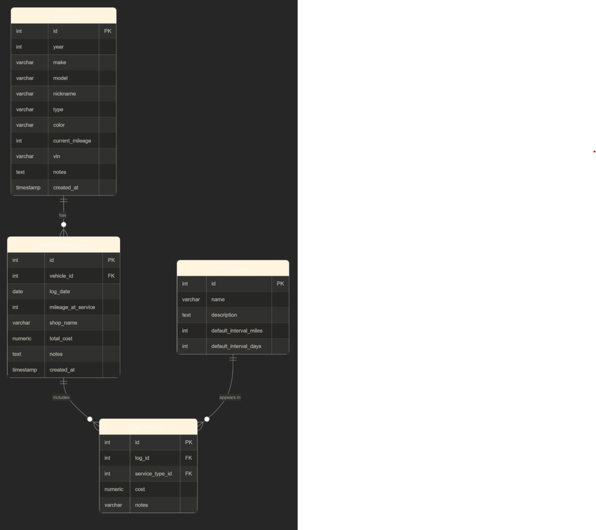

# vehicle-maintenance-tracker
Keep track of your car and figure out what maintainance you missed that caused your motor to blow up

# Vehicle Maintenance Tracker

A Streamlit web application for tracking maintenance history across a personal collection of vehicles, including cars, motorcycles, and trucks. Built with Python, Streamlit, and PostgreSQL.

## Live App

[Click here to open the app](https://vehicle-maintenance-tracker-iu47zrmirtmxevxqwfffqz.streamlit.app/)

## ERD



## Database Tables

**vehicle_types** — Lookup table for vehicle categories (Car, Motorcycle, Truck). Used to populate the type dropdown when adding a vehicle.

**vehicles** — Stores each vehicle in the collection including year, make, model, nickname, type, color, mileage, and VIN.

**service_types** — Stores the types of services that can be performed (e.g. Oil Change, Tire Rotation). Includes default intervals in miles and days.

**maintenance_logs** — Records each maintenance visit for a vehicle, including the date, mileage at service, shop name, total cost, and notes.

**log_services** — Junction table linking maintenance logs to service types. A single log can include multiple services, and a service type can appear across many logs (many-to-many relationship).

## How to Run Locally

1. Clone the repository:
```bash